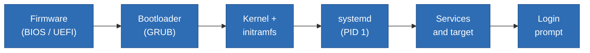



---

## **What is Linux?**

[**Linux**](https://en.wikipedia.org/wiki/Linux) is an [open source](https://en.wikipedia.org/wiki/Open_source) [**Operating Systems (OS)**](https://en.wikipedia.org/wiki/Operating_system) kernel. it is basically a program that talks to the hardware and shares the information between all the other programs.

An **Operating System (OS)** is the software that manages hardware resources (CPU, memory, disks, and network) and provides services so that applications can run.

Linux was created by **Linus Torvalds** in 1991 and is developed in the open by many contributors and companies.

---

## **Why Does Linux Matter?**

There are a couple of reasons why Linux matters, and learning about them is important:

### Open source

> The source code is public and people can inspect, modify, and redistribute it under licenses. **Free** here means *no cost* and *freedom to change it*. Companies still sell paid support (such as RHEL and Ubuntu Pro).

### Runs almost anywhere

> Linux can be used on cloud virtual machines, web servers, containers, Android phones, routers, and smart TVs.

### Automation friendly

> Nearly everything is configured with text files and commands, so it can be scripted, versioned in Git, and automated.

### Stable and transparent

> Linux can run for months without rebooting, and its logs and tools let you see what the system is doing.

### The foundation of modern infrastructure

> Most importantly, Linux is the foundation for understanding modern infrastructure such as containers, Kubernetes, CI/CD, and most DevOps tools run on Linux.

---

## **What is Kernel?**

[Kernel](https://en.wikipedia.org/wiki/Kernel_(operating_system)) is the core program of an OS. It sits between your hardware (CPU, memory, disks, network) and the programs. It basically the manager that other programs need.

### What does it do?

#### Process Management

> Decides which program run on CPU and for how long.

#### Memory Management

> Gives each program its own memory space and keeps them separate.

#### Device Drivers

> Talks to hardware so program don't have to know the details of each device.

#### File Systems

> Organizes how data is stored and read.

#### Networking

> Handles sending and receiving data over network.

#### Security

> Enforces permissions, so programs can't freely access things it shouldn't

---

## **Distributions (Distros)**

[Distributions](https://en.wikipedia.org/wiki/Linux_distribution) is a complete, ready to use operating system built around the Linux kernel. Think of the kernel as the coffee bean, the essential ingredient and the distro is the finished cup of coffee.

### What does a distribution provide?

- A tested kernel build.
- A package manager and its repositories with ready made software.
- An installer with default configuration.
- A release policy.
- A community or company that supports it.

### Main Families

> Check out the entire family tree [Distrowatch](https://distrowatch.com/dwres.php?resource=family-tree)
{: .prompt-tip}

| Family | Examples | Package Format/Tool | Typical Use |
|---|---|---|---|
| Debian | Debian, Ubuntu, Linux Mint, Raspberry Pi OS | .deb / `apt, dpkg` | Servers, cloud images, desktops, container base images |
| Red Hat (RHEL) | RHEL, Rocky Linux, Fedora, CentOS | .rpm / `dnf, rpm` | Enterprise server |
| SUSE | SLES, openSUSE | .rpm / `zypper` | Enterprise, SAP |
| Arch | Arch Linux, Manjaro | .pkg.tar.zst / `pacman` | Enthusiast, DIY |

### Release Models

| Model | How It Works | Example |
|---|---|---|
| Fixed/LTS | New major version roughly every 2 years, each supported for 5 years security fixes, **Predictable and stable** | Ubuntu LTS, Linux Mint LTS, Debian stable |
| Rolling | No versions, packages always up to date | Arch, openSUSE Tumbleweed |
| Fast Cycle/upstream | New release about every 6 months (Fedora), tests features for enterprise distros | Fedora, CentOS Stream |

---

## **Terminal, Shell, and Command Line**

Words that are often mixed up:

| Term | Meaning |
|---|---|
| Terminal | The window where you type and read text. |
| Shell | The program inside the terminal that reads the commands and runs them (such as `bash, zsh, fish`) |
| Command Line (CLI) | The interface style, simply controlling the computer by typing commands instead of clicking |
| Desktop Environment | Optional graphical layer (such ash `GNOME, KDE, XFCE`)|

### Anatomy of a Commands

```
$ ls -l /etc
  |  |  |
  |  |  +-- argument : what to act on (a file, directory, name...)
  |  +------ option   : changes behaviour (short -l, long --long)
  +--------- command  : the program to run

user@server:~$    <- '$' = normal user        root@server:~#    <- '#' = root (administrator)
```
**Note:**

- **Linux is case sensitive**: `test.txt` and `Test.txt` are different
- **Spaces separate words**: File with spaces, must be quoted `"this test.txt"`
- **Suprise output**: most commands output nothing when they succeed
- **Getting help**: `man` (manual), `cd --help` (Option help) is your best friend.

---

## **Stages of Linux Boot Process**



| Stage | What Happens |
|---|---|
| **Firmware** | Tests the hardware and finds the boot disk |
| **Bootloader** | GRUB loads the kernel and initramfs (temporary filesystem with drivers needed to reach the real disk) into memory |
| **Kernel** | Initializes hardware, mounts the root filesystem, and starts first process |
| **systemd** | The first user-space process. It starts everything else |
| **Services** | systemd starts services until it reaches the target |
| **Login** | Console login appears |

**Why this matters:** Understanding the boot flow helps when a server does not boot, because it gives you a clue about where to look.

---

## **Repositories**

[Repository](https://docs.github.com/en/repositories/creating-and-managing-repositories/about-repositories) its a place of centralized storage location used to organize, store, and host packages. Systems read its list from `/etc/apt/sources.list` and `/etc/apt/sources.list.d/` (Debian family) or `/etc/yum.repos.d/`.

> Each repo has a **GNU Privacy Guard Key (GPG Key)** which are used to encrypt, decrypt, and digitally sign data so package manager can verify the packages.
{: .prompt-tip}

### Other ways software is delivered

| Method |  What it is | Guidance |
|---|---|---|
| Vendor Repository | The software vendor's own apt/dnf repo (Docker, nginx, PostgreSQL) | For up to date releaases |
| Snap/Flatpak/AppImage | Bundled apps with their own libraries | Convenient for desktop apps |
| Container Image | Run with Docker or Kubernetes | Preferred for deploying applications |

---

## **Installing, Updating, and Removing Packages**

The day to day commands for updating, searching, inspecting, and installing:

```bash
# refresh local package index
$ sudo apt update

# find packages by keyword
$ apt search nginx

# description, version, dependencies, size
$ apt show nginx

# installed vs candidate version and which repo it comes from
$ apt-cache policy nginx

# install package
$ sudo apt install nginx
```

### Packages Command Cheatsheet

| Task | Debian/Ubuntu | RHEL/Rocky |
|---|---|---|
| Refresh Package Index | `apt update` | `dnf makecache` |
| Search | `apt search <package>` | `dnf search <package>` |
| Show Details | `apt show <package>` | `dnf info <package>` |
| Install | `apt install <package>` | `dnf install <package>` |
| Instal Multiple | `apt install <package1> <package2>` | `dnf install <package1> <package2>` |
| Install from Local | `apt install ./<package>.deb` | `dnf install ./<package>.rpm` |
| Upgrade Packages | `apt upgrade` | `dnf upgrade` |
| Remove Package (Keep Config) | `apt remove <package>` | `dnf remove <package>` |
| Remove Package (Including Config) | `apt purge <package>` | Auto purge on remove (if not modified) |
| Remove Unused Dependencies | `apt autoremove` | `dnf autoremove` |
| List Installed Packages | `apt list --installed` | `dnf list installed` |
| Clean Download Cache | `apt clean` | `dnf clean all` |



---

## **How to Start Practicing Linux?**

There are a several ways you can start practicing Linux right now, shown below:

| Option | How? | Limits |
|---|---|---|
| Local VM (Recommended) | VirtualBox, VMware Workstation, QEMU+VMM |  Needs some spare resources |
| WSL (Windows) | `wsl --install -d ubuntu` | Some kernel/network features differ |
| Cloud VM | AWS, Azure, GCP | Costs money if left unchecked |
| Container | `docker run -it ubuntu:24.04 bash` | Shares host kernel |
| Bootable USB/Dual Boot | Distro desktop installer, Portable Images | Risky if partitioning goes wrong |

---

## **First Minutes on Linux**

```bash
# which user am I?
$ whoami

# what machine is this?
$ hostname

# which distribution and version?
$ cat /etc/os-release
$ lsb_release -a

# which kernel version?
$ uname -r

# how long up, and the load average
$ uptime

# memory
$ free -h

# disk space
$ df -h

# IP addresses
$ ip -br addr

# some running processes
$ ps aux | head

# what is in my home directory?
$ ls -la ~

# what was recently typed here?
$ history | tail
```

## Practice



---

## **Glossary**

| Term | Detail |
|---|---|
| Kernel | Core of the OS, manages CPU, memory, devices, filesystems, networking |
| Distribution (Distro) | Kernel, package manager and defaults that are packaged as a usable OS |
| Shell | Program that interprets typed commands (bash, zsh) |
| Package | Archive with software files, metadata, scripts, and dependencies |
| Daemon/service | Background program, usually started at boot |
| root | Administrator account (UID 0) |
| sudo | Runs command with elevated privileges |
| Mount Point | Directory where filesystem is attached to the tree |
| LTS | Long Term Support, a release with security updates for years |
| Open Source | Source code is available |
| Container | Isolated process group sharing the host kernel | 

---

## **Hands-On Cases**

**Scenario:** You've just been given access to a Linux machine. Your job is to create a small project workspace, add some files, and organize them using only the terminal.

Try each step yourself first, then open the solution to check.

### Step 1: Find out where you are

Print your current directory and list what's in it.

<details markdown="1">
<summary>Show solution</summary>

```bash
# print the current working directory
pwd

# list the files here
ls
```

> `pwd` means "print working directory". Right after login you are normally in your home directory (`/home/yourname`).
{: .prompt-tip}

</details>

### Step 2: Create the workspace

Create a directory called `linux-lab` in your home folder, with three subdirectories inside it: `docs`, `backup` and `scripts`. Then move into `linux-lab`.

<details markdown="1">
<summary>Show solution</summary>

```bash
# create the folder and its subfolders in one command
mkdir -p ~/linux-lab/{docs,backup,scripts}

# alternatively doing it one by one
mkdir -p ~/linux-lab/docs
mkdir -p ~/linux-lab/backup
mkdir -p ~/linux-lab/scripts

# move into the workspace
cd ~/linux-lab

# check the result
ls
```

> `-p` creates parent directories as needed and doesn't complain if they already exist. The `{docs,backup,scripts}` part is shell brace expansion, which produces three paths from one expression.
{: .prompt-tip}

</details>

### Step 3: Create empty files

Create three empty files in `linux-lab`: `notes.txt`, `todo.txt` and `draft.txt`.

<details markdown="1">
<summary>Show solution</summary>

```bash
# create empty files
touch notes.txt todo.txt draft.txt

# list with details to confirm they exist (size 0)
ls -l
```

> `touch` creates an empty file if it doesn't exist. If it does exist, it only updates the modification time.
{: .prompt-tip}

</details>

### Step 4: Put content in a file

Write the line `Hello Linux` into `notes.txt`, then add a second line `My first workspace`. Display the file to verify.

<details markdown="1">
<summary>Show solution</summary>

```bash
# > overwrites the file with this text
echo "Hello Linux" > notes.txt

# >> appends to the end of the file
echo "My first workspace" >> notes.txt

# show the file contents
cat notes.txt
```

> Be careful with `>`. It replaces everything in the file, while `>>` keeps the existing content and adds to it.
{: .prompt-tip}

</details>

### Step 5: Copy a file

Copy `notes.txt` into the `backup` directory. Keep the original where it is.

<details markdown="1">
<summary>Show solution</summary>

```bash
# copy the file into backup/
cp notes.txt backup/

# confirm both copies exist
ls notes.txt backup/
```

> `cp source destination` leaves the original untouched.
{: .prompt-tip}

</details>

### Step 6: Rename and move a file

Rename `draft.txt` to `report.txt`, then move it into the `docs` directory.

<details markdown="1">
<summary>Show solution</summary>

```bash
# rename: mv with a new name in the same directory
mv draft.txt report.txt

# move into docs/
mv report.txt docs/

# confirm
ls docs/
```

> `mv` is used for both renaming and moving. It just changes the file's name or location, and doesn't leave a copy behind.
{: .prompt-tip}

</details>

### Step 7: Copy a whole directory

Copy the entire `docs` directory into `backup`.

<details markdown="1">
<summary>Show solution</summary>

```bash
# -r means recursive: needed to copy directories
cp -r docs backup/

# check what is inside backup
ls -R backup
```

> Without `-r`, `cp` refuses to copy a directory.
{: .prompt-tip}

</details>

### Step 8: Clean up

Delete `todo.txt`, because you no longer need it.

<details markdown="1">
<summary>Show solution</summary>

```bash
# delete the file
rm todo.txt

# confirm it is gone
ls
```

> `rm` is permanent. There is no trash bin in the terminal, so double-check the filename before you press Enter. To be asked first, use `rm -i todo.txt`.
{: .prompt-tip}

</details>

### Step 9: Check your final result

Show the whole workspace as a recursive listing.

<details markdown="1">
<summary>Show solution</summary>

```bash
# list everything under the current directory
ls -R
```

Your workspace should look roughly like this:

```text
linux-lab/
├── backup/
│   ├── docs/
│   │   └── report.txt
│   └── notes.txt
├── docs/
│   └── report.txt
├── scripts/
└── notes.txt
```

</details>

## **Finish**

Thank you for reading or following until the end!

---


